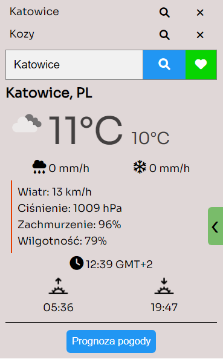
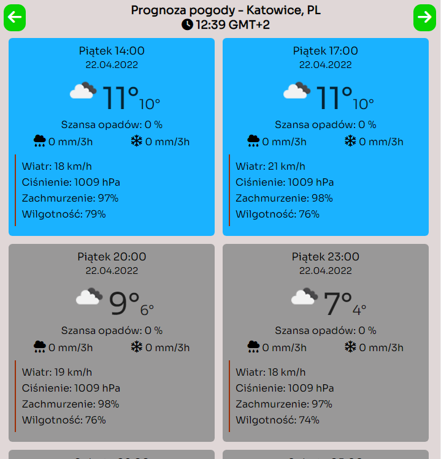

# Weather Extension

Chrome extension showing the current weather and 5 Day / 3 Hour Forecast in any city. Also display AQI on hover or click to learn more about AQI. <br />
Made in JavaScript, layout made in HTML and SCSS.<br />
Weather data from [OpenWeatherMap](https://openweathermap.org/)

## Get the code

```bash
git clone https://github.com/rnycz/weather-extension.git
```
Remember to add YOUR API KEY

## How it works?

Type any city or choose from favorite list. At any time you can add typed city to the favorite list. <br />
 <br />
Then search for a current weather.<br />
<br />
There is a button at the bottom to check the forecast.<br />
